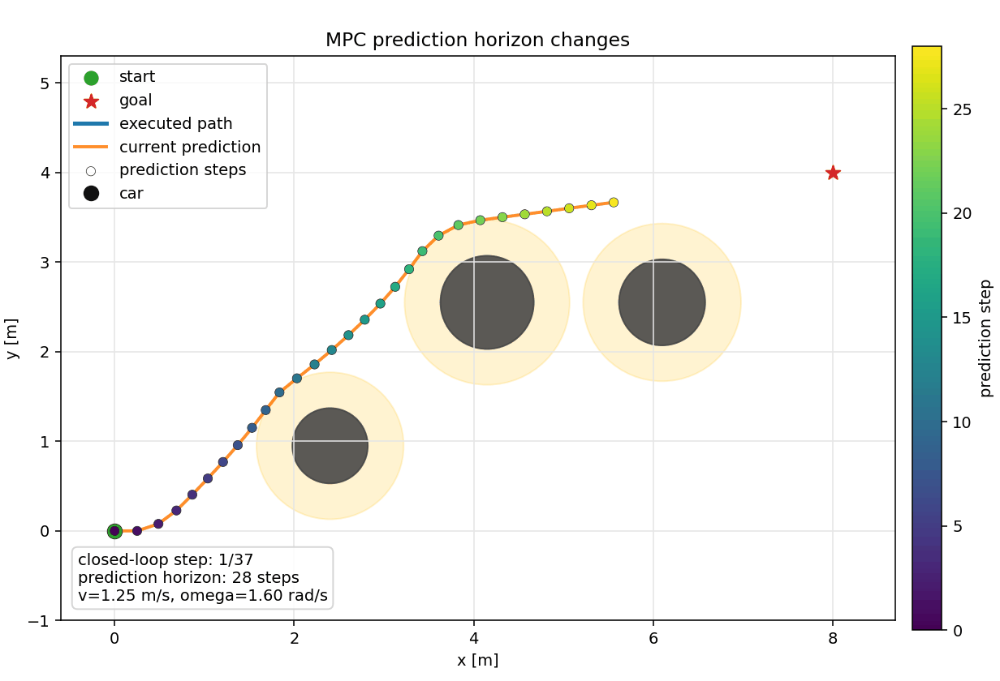
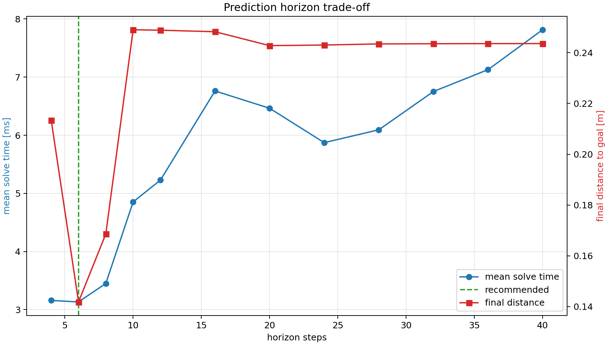

# CasADi MPC 小车避障 Demo

这是一个小型非线性 MPC 项目：用 CasADi + IPOPT 控制一个二维小车从起点到目标点，同时避开圆形障碍物。

模型采用 unicycle/差速小车：

```text
x[k+1]     = x[k] + dt * v[k] * cos(theta[k])
y[k+1]     = y[k] + dt * v[k] * sin(theta[k])
theta[k+1] = theta[k] + dt * omega[k]
```

MPC 每一步求解一个有限时域最优控制问题：

- 追踪目标点 `(x_goal, y_goal, theta_goal)`
- 限制速度 `v` 和角速度 `omega`
- 对每个圆形障碍物加入距离约束
- 滚动执行第一个控制量，然后重新规划


## 演示效果



## 预测步 Benchmark 结果



推荐预测步：**6**。筛选规则是在安全到达目标且无求解失败的结果中，选择最终距离接近最优值且平均求解时间最短的预测步。

| horizon | mean solve ms | total runtime s | final distance m | min safety margin m | steps | failures | reached |
|---:|---:|---:|---:|---:|---:|---:|:---:|
| 4 | 3.16 | 0.137 | 0.213 | 0.000000 | 39 | 0 | yes |
| 6 **best** | 3.13 | 0.128 | 0.142 | 0.000000 | 39 | 0 | yes |
| 8 | 3.45 | 0.138 | 0.169 | 0.000000 | 38 | 0 | yes |
| 10 | 4.85 | 0.192 | 0.249 | 0.000000 | 38 | 0 | yes |
| 12 | 5.23 | 0.208 | 0.249 | 0.000000 | 38 | 0 | yes |
| 16 | 6.76 | 0.269 | 0.248 | 0.000000 | 38 | 0 | yes |
| 20 | 6.46 | 0.254 | 0.243 | 0.000000 | 37 | 0 | yes |
| 24 | 5.87 | 0.235 | 0.243 | 0.000000 | 37 | 0 | yes |
| 28 | 6.09 | 0.245 | 0.243 | 0.000000 | 37 | 0 | yes |
| 32 | 6.75 | 0.273 | 0.244 | 0.000000 | 37 | 0 | yes |
| 36 | 7.13 | 0.290 | 0.244 | 0.000000 | 37 | 0 | yes |
| 40 | 7.81 | 0.317 | 0.244 | 0.000000 | 37 | 0 | yes |

## 安装

推荐创建项目内虚拟环境：

```bash
cd "/Users/a1/Library/Mobile Documents/com~apple~CloudDocs/work/car_obstacle_mpc"
python3 -m venv .venv
source .venv/bin/activate
python -m pip install -r requirements.txt
```

如果你使用已经创建好的 conda 环境 `car`：

```bash
conda activate car
cd "/Users/a1/Library/Mobile Documents/com~apple~CloudDocs/work/car_obstacle_mpc"
python -m pip install -r requirements.txt
```

## 运行

```bash
python run_demo.py
```

默认会把结果图保存到项目目录：

```text
car_obstacle_mpc_trajectory.png
```

也可以自定义输出路径：

```bash
python run_demo.py --output /tmp/mpc_result.png
```

## 查看 MPC 预测步动画

仓库里已经包含一份示例动画：

```text
assets/mpc_animation.gif
```

生成 GIF 动画：

```bash
python run_demo.py --no-show --animate
```

默认会保存到项目目录：

```text
mpc_prediction.gif
```

也可以自定义动画输出路径和帧率：

```bash
python run_demo.py --no-show --animate --animation-output ./mpc_prediction.gif --animation-fps 8
```

## 测试不同预测步的耗时和精度

仓库里已经包含一份 CSV 测试表格：

```text
reports/test_results.csv
```

运行 benchmark：

```bash
python benchmark_horizon.py
```

默认会测试：

```text
4, 6, 8, 10, 12, 16, 20, 24, 28, 32, 36, 40
```

输出会保存在项目目录的 `benchmark_results/`：

- `horizon_benchmark.csv`：每个预测步的数值结果
- `horizon_benchmark.json`：机器可读结果和推荐预测步
- `horizon_benchmark.png`：耗时/精度折线图
- `horizon_benchmark_report.md`：推荐结论和表格

也可以自定义要测试的预测步：

```bash
python benchmark_horizon.py --horizons 10,15,20,25,30,35
```

## 可以改的参数

主要参数在 `src/car_obstacle_mpc/config.py`：

- `dt`：离散时间步长
- `horizon_steps`：MPC 预测步数
- `max_speed` / `max_omega`：控制约束
- `robot_radius` / `safety_margin`：避障安全距离
- `start` / `goal`：起点和目标点
- `obstacles`：圆形障碍物位置和半径

## 项目结构

```text
.
├── README.md
├── pyproject.toml
├── requirements.txt
├── run_demo.py
└── src/car_obstacle_mpc
    ├── __init__.py
    ├── config.py
    ├── mpc.py
    ├── plotting.py
    └── simulate.py
```
